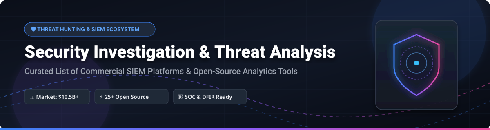

  

  
  
  
  
  
  

---

# 🛡️ Awesome Security Investigation & Threat Analysis

A curated, SEO-optimized ecosystem guide of **Commercial SaaS Security Platforms** and **Open-Source GitHub Projects** for Security Operations Centers (SOC), Digital Forensics and Incident Response (DFIR) teams, Security Information and Event Management (SIEM), Threat Intelligence (CTI), and proactive Threat Hunting.

> **Last updated**: October 2026

---

## 📌 Table of Contents

- [📊 SaaS &amp; Commercial Security Platforms](#-saas--commercial-security-platforms)
- [⚡ Open-Source Security Projects](#-open-source-security-projects)
  - [🔎 SIEM &amp; Security Analytics](#-siem--security-analytics)
  - [🎯 Threat Intelligence &amp; Case Management](#-threat-intelligence--case-management)
  - [🕵️ Endpoint Forensics &amp; Threat Hunting](#-endpoint-forensics--threat-hunting)
  - [📡 Network Security Monitoring &amp; Packet Analysis](#-network-security-monitoring--packet-analysis)
  - [⚙️ Detection-as-Code &amp; Testing Frameworks](#️-detection-as-code--testing-frameworks)
- [📈 Star History](#-star-history)
- [💖 Support &amp; Contributing](#-support--contributing)
- [⚠️ Disclaimer](#️-disclaimer)

---

## 📊 SaaS &amp; Commercial Security Platforms

> 💡 **Market Overview & Fragmentation**: The global SIEM and Security Investigation market is estimated at **~$10.5 Billion**, growing at a **~14.5% CAGR**. The sector is **moderately fragmented**, characterized by intense competition between cloud hyperscalers (Microsoft, Google, AWS), established cybersecurity giants (Splunk/Cisco, Datadog), and innovative detection-as-code startups (Panther Labs, Securonix), alongside self-hosted open-source security stacks.

*Platforms below are sorted by **Company Market Cap / Valuation** in descending order.*

| 🏢 Platform &amp; Description | 💰 Specific Starting Pricing | 🎁 Free Tier / Free Trial Limits | 📈 Company Size / Valuation |
| :--- | :--- | :--- | :--- |
| **[Microsoft Sentinel](https://azure.microsoft.com/en-us/products/microsoft-sentinel)** Cloud-native SIEM and SOAR deeply integrated with Azure, Microsoft 365, and multi-cloud environments. | **$4.30 / GB ingested** *(Pay-as-you-go Log Analytics + Sentinel)* | **31-Day Free Trial** Up to **10 GB/day** ingested across up to 20 workspaces. | **~$3.1 Trillion** *(Microsoft Corp)* |
| **[Google Chronicle](https://cloud.google.com/chronicle)** Petabyte-scale cloud SIEM leveraging Google infrastructure, UDM normalization, and YARA-L rule detection. | **$2.50 / GB ingested** *(or ~$45 / user / year enterprise model)* | **30-Day Free Trial** Via GCP free tier with **$300 credits**. | **~$2.1 Trillion** *(Alphabet Inc)* |
| **[Amazon Detective](https://aws.amazon.com/detective/)** AWS security investigation service that automatically analyzes and visualizes telemetry from GuardDuty and CloudTrail. | **$2.00 / GB ingested** *(First 1,000 GB/month volume tier)* | **30-Day Free Trial** Full feature access on all AWS accounts. | **~$2.0 Trillion** *(Amazon.com Inc)* |
| **[Splunk Enterprise Security](https://www.splunk.com/en_us/products/enterprise-security.html)** The enterprise SIEM standard offering advanced correlation, UEBA, and extensive app marketplace integration. | **$1,800 / GB / year** *(or ~$4.00 / GB ingested on Splunk Cloud)* | **14-Day Free Trial** Splunk Cloud trial (or 60-day Enterprise trial capped at 500 MB/day). | **~$190 Billion** *(Cisco Systems / Splunk)* |
| **[Datadog Cloud SIEM](https://www.datadoghq.com/)** Cloud SIEM integrated into observability platform for unified security logging, alerting, and metrics. | **$0.20 / GB analyzed / mo** *+ $15.00 / host / month base* | **14-Day Free Trial** Full access to Datadog platform &amp; Cloud SIEM. | **~$38.0 Billion** *(Datadog Inc)* |
| **[Elastic Security](https://www.elastic.co/security)** Enterprise SIEM, endpoint protection, and timeline investigation built natively on Elastic Cloud. | **$95.00 / month** *(Elastic Cloud Standard deployment tier)* | **14-Day Free Trial** Full Elastic Cloud deployment trial. | **~$9.0 Billion** *(Elastic NV)* |
| **[Rapid7 InsightIDR](https://www.rapid7.com/products/insightidr/)** Cloud SIEM combining user behavior analytics (UEBA), endpoint detection, network traffic analysis, and honeypots. | **$5.77 / asset / month** *(Billed annually for 500 assets)* | **30-Day Free Trial** Full capabilities for up to 100 endpoints. | **~$2.4 Billion** *(Rapid7 Inc)* |
| **[Exabeam](https://www.exabeam.com/)** Behavioral analytics-led SIEM platform automating threat detection, threat hunting timelines, and incident response. | **$6.00 / user / month** *(or ~$25,000 / year platform base)* | **30-Day Free Trial** Interactive sandbox evaluation on request. | **~$2.4 Billion** *(Exabeam Valuation)* |
| **[Panther Labs](https://panther.com/)** Cloud-native SIEM built on Python detection-as-code, real-time alert processing, and serverless data lakes. | **$30,000 / year** *(Base Enterprise Cloud SaaS platform tier)* | **30-Day Free Trial** Enterprise POC environment upon request. | **~$1.4 Billion** *(Panther Labs Valuation)* |
| **[Securonix](https://www.securonix.com/)** Cloud-native SIEM featuring AI-driven UEBA, autonomous threat hunting, SOAR integration, and insider threat monitoring. | **$15,000 / year** *(Base SaaS tier platform subscription)* | **30-Day Free Trial** Guided proof-of-concept sandbox on request. | **~$1.0 Billion** *(Securonix Valuation)* |

---

## ⚡ Open-Source Security Projects

Top open-source security tools and frameworks for self-hosted SIEM, threat hunting, network monitoring, digital forensics, and incident management.

*All open-source repositories below are sorted by **GitHub Stars_Count** in descending order.*

### 🔎 SIEM &amp; Security Analytics

- **[Elasticsearch](https://github.com/elastic/elasticsearch)**  
    
  **Distributed search and analytics engine powering the Elastic SIEM stack.** Apache-2.0 / Elastic Licensed. Ingests petabyte-scale security events with real-time indexing and search capabilities.

- **[Wazuh](https://github.com/wazuh/wazuh)**  
    
  **The leading unified open-source SIEM &amp; XDR platform.** GPLv2 licensed. Features endpoint HIDS agents, File Integrity Monitoring (FIM), vulnerability detection, rootkit scanning, and 1,000+ out-of-the-box MITRE ATT&amp;CK detection rules using OpenSearch backend.

- **[OpenSearch Security Analytics](https://github.com/opensearch-project/OpenSearch)**  
    
  **100% open-source search suite with built-in Security Analytics.** Apache-2.0 licensed. Out-of-the-box support for Sigma rule detection, threat intelligence mapping, log correlation, and real-time security alerting.

- **[Security Onion](https://github.com/Security-Onion-Solutions/securityonion)**  
    
  **Comprehensive Linux distribution for threat hunting, enterprise security monitoring, and log management.** Integrates Suricata, Zeek, Elastic Stack, Strelka, and full packet capture capabilities.

- **[HELK (Hunting ELK)](https://github.com/Cyb3rWard0g/HELK)**  
    
  **Threat hunting platform with advanced analytics capabilities.** GPL-3.0 licensed. Combines Kafka, Logstash, Elasticsearch, Kibana, Jupyter Notebooks, and Graph Analytics (GraphFrames) for hunting complex threats.

- **[Matano](https://github.com/matanolabs/matano)**  
    
  **Open-source, serverless security data lake SIEM for AWS.** Apache-2.0 licensed. Ingests petabytes of logs into Apache Iceberg Parquet tables on S3, providing detection-as-code in Python and SQL querying via Athena/Snowflake.

---

### 🎯 Threat Intelligence &amp; Case Management

- **[BloodHound](https://github.com/BloodHoundAD/BloodHound)**  
    
  **Active Directory and cloud security relationship graphing tool.** GPL-3.0 licensed. Uses graph theory to reveal hidden relationships and attack paths within Active Directory and Azure environments.

- **[OpenCTI](https://github.com/OpenCTI-Platform/opencti)**  
    
  **Open-source Cyber Threat Intelligence (CTI) management platform.** Apache-2.0 licensed. Manages cyber threat knowledge, indicators of compromise (IOCs), threat actors, and TTPs using structured STIX 2.1 data models.

- **[MISP](https://github.com/MISP/MISP)**  
    
  **The de facto open-source malware information sharing &amp; threat intelligence platform.** AGPL-3.0 licensed. Stores, correlates, and shares technical indicators, financial fraud data, and vulnerability information.

- **[TheHive](https://github.com/TheHive-Project/TheHive)**  
    
  **Security Incident Response Platform and case management system.** AGPL-3.0 licensed. Enables collaborative SOC case tracking, task delegation, live analysis, and integration with MISP &amp; Cortex.

- **[Shuffle](https://github.com/Shuffle/Shuffle)**  
    
  **Open-source Security Automation and Orchestration (SOAR) framework.** Apache-2.0 licensed. Features intuitive workflow automation, API integration, and playbooks for incident response teams.

- **[Cortex](https://github.com/TheHive-Project/Cortex)**  
    
  **Powerful observable analysis and active response engine.** AGPL-3.0 licensed. Automates enrichment of IPs, URLs, domains, and file hashes using over 100+ built-in analyzers.

---

### 🕵️ Endpoint Forensics &amp; Threat Hunting

- **[osquery](https://github.com/osquery/osquery)**  
    
  **SQL-powered operating system instrumentation and telemetry.** Apache-2.0 licensed. Exposes host status, running processes, network connections, and system configurations as queryable relational SQL tables.

- **[Falco](https://github.com/falcosecurity/falco)**  
    
  **Cloud-native container runtime security &amp; threat detection.** Apache-2.0 licensed (CNCF Graduated). Monitors eBPF system calls in real-time to detect anomalous container activity and kernel exploits.

- **[Fleet](https://github.com/fleetdm/fleet)**  
    
  **Open-source osquery fleet manager &amp; endpoint security platform.** MIT licensed. Enables centralized control, real-time querying, and vulnerability reporting across thousands of endpoints.

- **[GRR Rapid Response](https://github.com/google/grr)**  
    
  **Google's scalable enterprise remote live digital forensics and incident response framework.** Apache-2.0 licensed. Conducts remote memory analysis, file collection, and host artifact inspection.

- **[Velociraptor](https://github.com/Velocidex/velociraptor)**  
    
  **Advanced endpoint forensic artifact collection &amp; threat hunting engine.** Apache-2.0 licensed. Uses Velociraptor Query Language (VQL) for fast live response and forensic triage at enterprise scale.

- **[Chainsaw](https://github.com/WithSecureLabs/chainsaw)**  
    
  **Rapid forensic search &amp; threat hunting engine for Windows Event Logs.** Apache-2.0 licensed. Rapidly searches event logs using Sigma rules and custom forensic detection patterns.

---

### 📡 Network Security Monitoring &amp; Packet Analysis

- **[Zeek](https://github.com/zeek/zeek)**  
    
  **Passive network security monitoring and metadata analysis framework.** BSD-3-Clause licensed. Translates raw network traffic into structured high-level log records for forensic investigations.

- **[Arkime](https://github.com/arkime/arkime)**  
    
  **Large-scale open-source packet capture (PCAP), indexing, and visual analysis system.** Apache-2.0 licensed. Stores and indexes network traffic for rapid PCAP retrieval and investigation.

- **[Suricata](https://github.com/OISF/suricata)**  
    
  **High-performance Network IDS, IPS, and Network Security Monitoring engine.** GPL-2.0 licensed. Performs deep packet inspection, TLS inspection, and HTTP protocol parsing.

- **[Snort 3](https://github.com/snort3/snort3)**  
    
  **Next-generation network intrusion detection and prevention system (NIDS/NIPS).** GPL-2.0 licensed. Features multi-threading, fast rule evaluation, and modular packet processing.

- **[RITA (Real Intelligence Threat Analytics)](https://github.com/activecm/rita)**  
    
  **Open-source network threat hunting tool for detecting C2 beaconing.** BSD-3-Clause licensed. Parses Zeek logs to identify DNS tunneling, beaconing behavior, and long connections.

---

### ⚙️ Detection-as-Code &amp; Testing Frameworks

- **[Atomic Red Team](https://github.com/redcanaryco/atomic-red-team)**  
    
  **Library of simple, portable, MITRE ATT&amp;CK-mapped security tests.** MIT licensed. Enables SOC teams to validate detection coverage and test SIEM rule effectiveness against adversary techniques.

- **[Sigma](https://github.com/SigmaHQ/sigma)**  
    
  **Generic signature format for SIEM detection rules.** Apache-2.0 licensed. The open standard for writing detection logic once and translating it to Splunk, Sentinel, Elastic, QRadar, or OpenSearch formats.

- **[MITRE ATT&amp;CK Navigator](https://github.com/mitre-attack/attack-navigator)**  
    
  **Web application for visualizing and manipulating MITRE ATT&amp;CK matrices.** Apache-2.0 licensed. Allows security teams to map detection coverage, red team exercises, and threat actor tactics.

---

## 📈 Star History

---

## 💖 Support &amp; Contributing

Thank you for exploring this curated security investigation ecosystem! If you find this list helpful for your SOC team, security research, or DFIR investigations:

- 🌟 **Star this repository** to show support and help others discover it.
- 🔀 **Fork &amp; Contribute** by submitting a Pull Request with new tools, updates, or fixes.
- 📢 **Share** with fellow security analysts, threat hunters, and security engineers.
- ☕ **Sponsor the Maintainer**: Consider supporting ongoing open-source maintenance via [GitHub Sponsors](https://github.com/sponsors/ishandutta2007).

Also, check out the curated list of lists at [Awesome-Awesome-Awesome](https://github.com/ishandutta2007/Awesome-Awesome-Awesome)!

---

## ⚠️ Disclaimer

- This repository is a **community-curated index** for informational and educational purposes.
- Security investigation platforms process highly sensitive log telemetry; properly configure access controls, data retention policies, and compliance guardrails before deployment.
- **Open-source SIEM hidden costs**: Self-hosted solutions require engineering maintenance, custom rule tuning, infrastructure management, and analyst triaging overhead. Verify compute requirements before production deployment.
